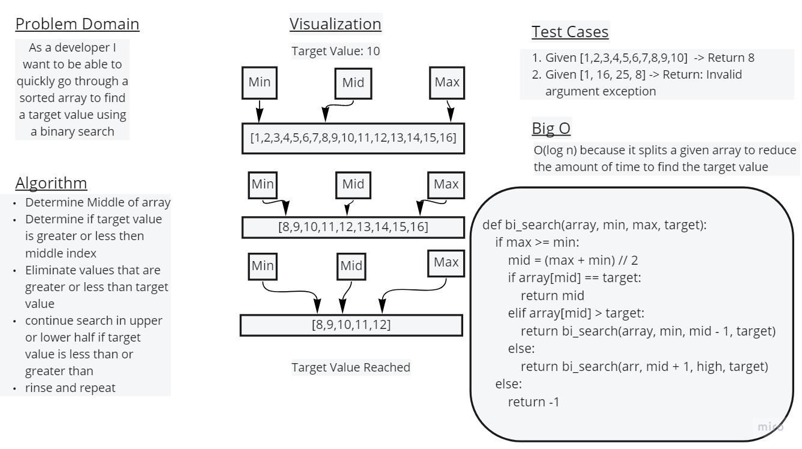

# Binary Search of an array
Iterating through an array with min and max values to reach a determined value

## Whiteboard Process

## Approach & Efficiency
Find min, max, and middle values, compare middle value to target value. Eliminate values either greater or less than middle value and repeat the process until target value has been reached.