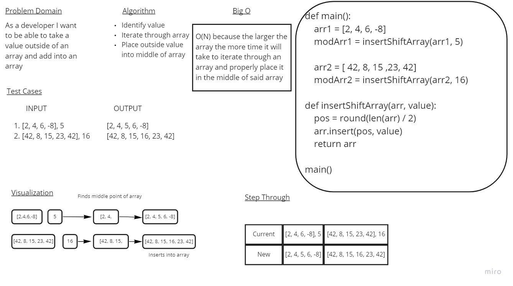

# Insert to Middle of an Array
Taking a value outside of an array and placing into the middle of an array

## Whiteboard Process

## Approach & Efficiency
Went through an array and found the halfway point to insert an outside value into it. The Big O for this is time because the longer the list the longer it will take to determine the middle of said list.