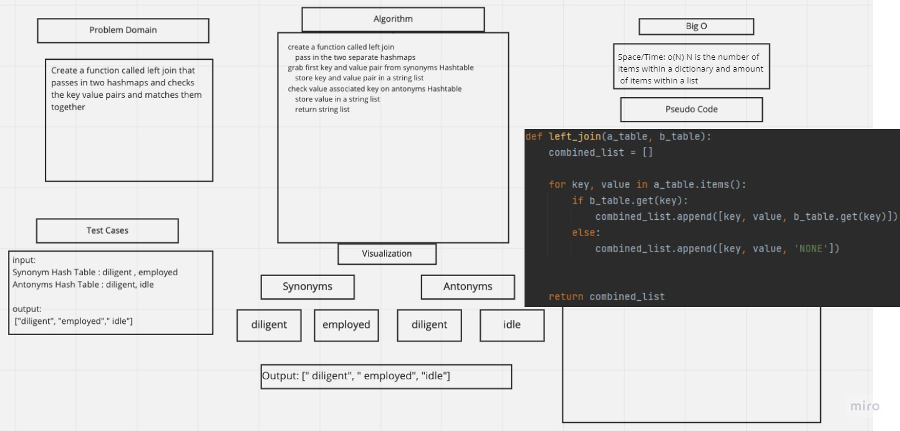

# Hashmap LEFT JOIN
Write a function that LEFT JOINs two hashmaps into a single data structure.
## Challenge
Implement a simplified LEFT JOIN for 2 Hashmaps.

## Approach & Efficiency
- Big O for both time and space is O(N) where N is the amount of items that are being iterated through and being added to an empty dictionary

## Solution

## Collaborators
- Jamall Malik
- Alec Torres
