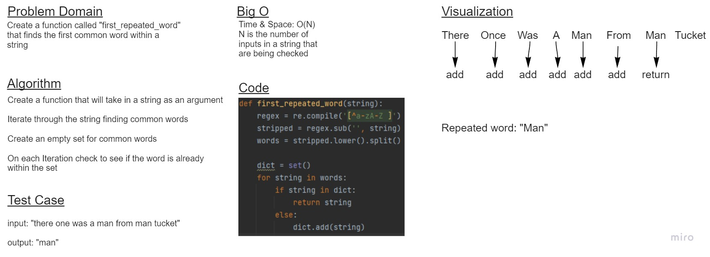

# Challenge Summary
Find the first repeated word in a book.

## Whiteboard Process

## Approach & Efficiency
- Used regex to see similarities as well as a dictionary for common words to stay. Big O for this project is O(N)

## Solution
I used pytest to see if tests are passing

## Collaborators
- Riki Plaza
- Jamall Malik
- Alec Torres
