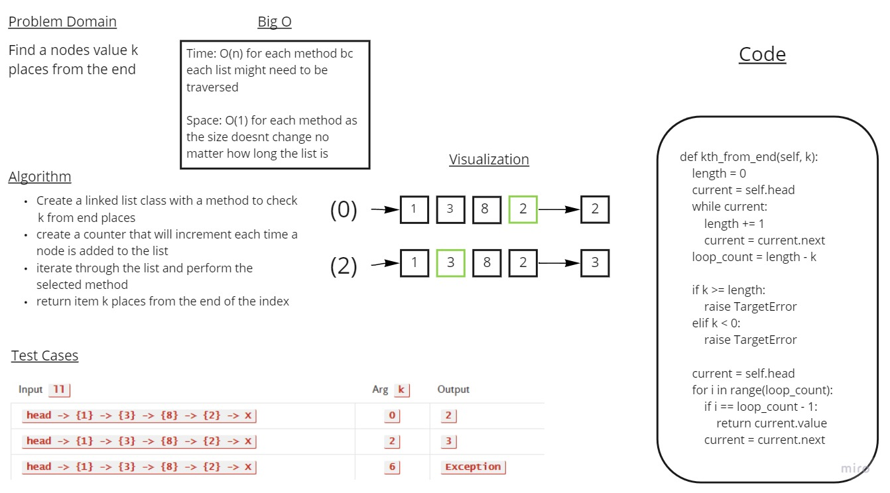

# Challenge Summary
k-th value from the end of a linked list.
## Whiteboard Process

## Solution
        def kth_from_end(self, k):
            length = 0
            current = self.head
            while current:
                length += 1
                current = current.next
            loop_count = length - k

            if k >= length:
                raise TargetError
            elif k < 0:
                raise TargetError

            current = self.head
            for i in range(loop_count):
                if i == loop_count - 1:
                    return current.value
                current = current.next
