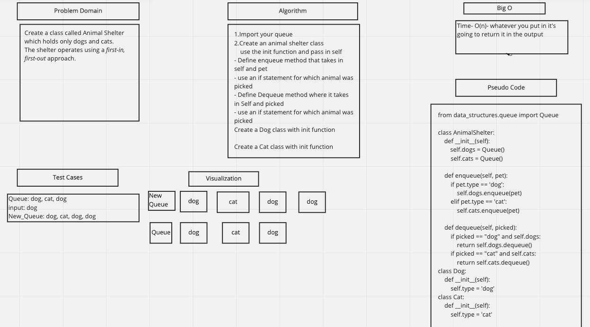

# Challenge Summary
First-in, First out Animal Shelter
## Whiteboard Process

## Solution
    def enqueue(self, pet):
        if pet.type == 'dog':
            self.dogs.enqueue(pet)
        elif pet.type == 'cat':
            self.cats.enqueue(pet)

    def dequeue(self, picked):
        if picked == "dog" and self.dogs:
            return self.dogs.dequeue()
        if picked == "cat" and self.cats:
            return self.cats.dequeue()
## Collaborators
- Riki Plaza
- Alec Torres
- Jamall Malik
