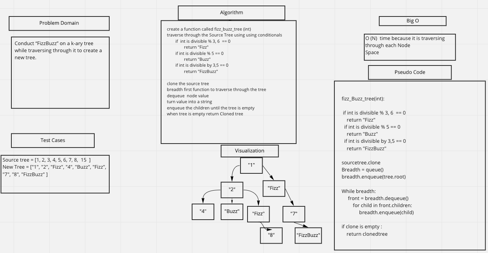

# Challenge Summary
Determine whether or not the value of each node is divisible by 3, 5 or both. Create a new tree with the same structure as the original, but the values modified
## Whiteboard Process

## Approach & Efficiency
Big O is O(N) for time and space where N is the number of nodes that are within the tree.

## Collaborators
- Riki Plaza
- Alec Torres
- Jamall Malik
