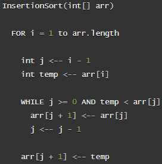
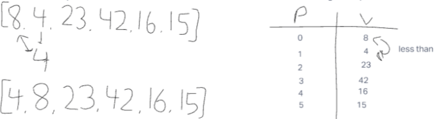
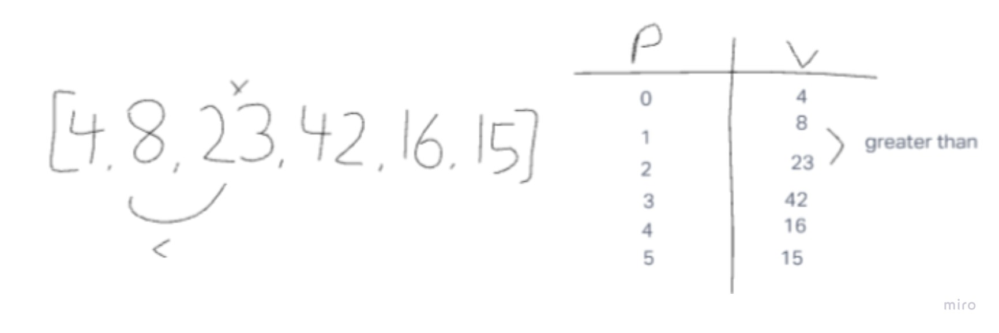
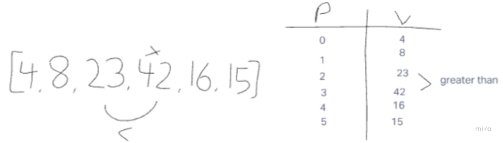
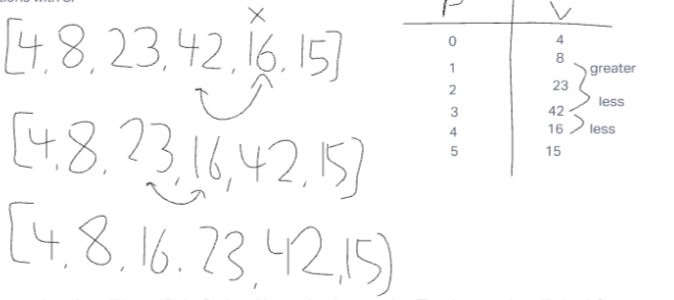
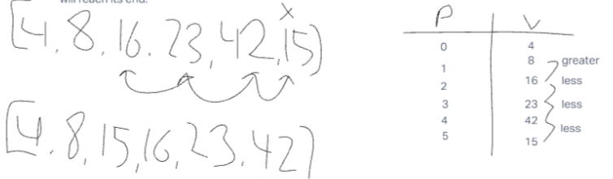
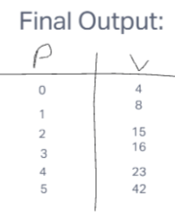

# Blog Notes: Insertion Sort
- This method will iterate through an array, storing a current value which then compars the current value to each previous value

## Pseudo:

## Steps:
- Assuming we are given a beginning input with an algorithm, we will be comparing a chosen value to ones before it within a list
- The chosen value will check through each iteration to verify if the values are greater or less than the one it is being compared to.
- Well start off with the value of 4 and compare it to its neighbors
- After determining the values we will move the compared value respectively

- The next iteration would consist of having 23 be the chosen value and will now be compared to its neighbors.
- Now since 23 is greater than all previously index values it will stay in its place in the mean time.

- Now well do the same with 42, and just like 23 since it is greater it will in place

- As we move on well notice that the compared value of 16 is less than the previous value it was compared too
- This chosen value will iterate through until its in the respective index

- Now for this final step 15 will be compared to all previous numbers and moved respectively until it is less than 16 and more than 8

