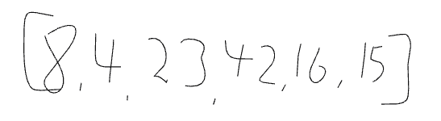
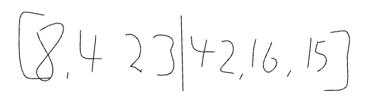
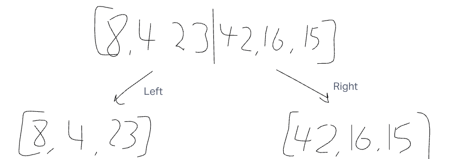
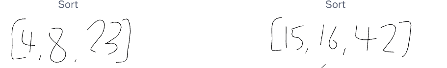
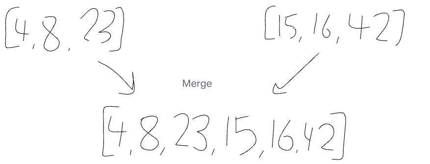
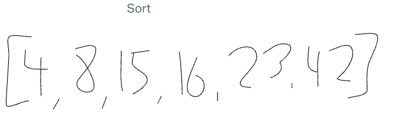

# Blog Notes: Merge Sort

- Assuming that we are given an input of randomized numbers
- We will be using the variable ***n*** to determine any values that are within a list

- After the fact we will then split our array in half and determine the left and right side

- Splitting the array into two will make them easier to sort.
- We will split the arrays into two, those being:
  - [8,4,23]
  - [42,16,15]

- Once they are split we will then sort through the smaller split arrays, iterating through and sorting the values

- We will now take these two arrays and merge them back together.

- Once we have our combined arrays into one again we will take this new list and sort one last time to make our final product

